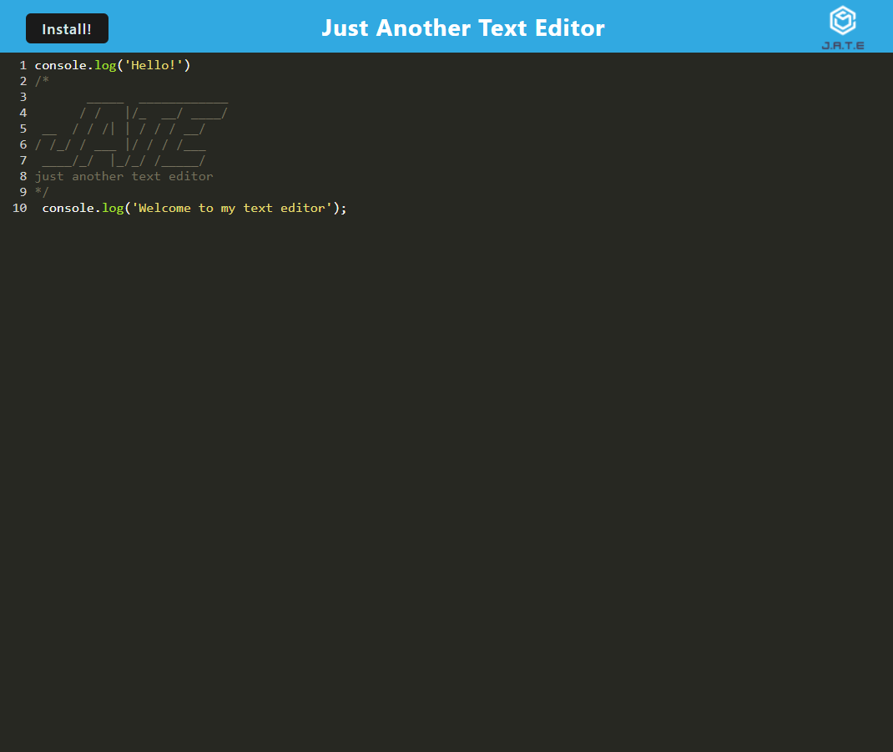

# Text-Editor-PWA
      

## Description
Sometimes, users want to use certain types of websites, like a text editor, even when they don't have a web connection and **progressive web applications** allow them to do that. Text Editor PWA is a progressive web application built with [Node.js](https://nodejs.org/en/), [Express](https://www.npmjs.com/package/express), [Webpack](https://webpack.js.org/), [Workbox](https://developer.chrome.com/docs/workbox/), a whole lot of plugins (check the `package.json` in the client folder), and of course, JavaScript, HTML, and CSS. The application was deployed through [Heroku](https://www.heroku.com/).

### Deployed Application

[JATE - Text Editor PWA](https://ggorosave-text-editor.herokuapp.com/)

## Table of Contents 

- [Installation](#installation)
- [Usage](#usage)
- [License](#license)
- [Contributing](#contributing)
- [Questions](#questions)

## Installation

Click the `Install` button in the top left corner of the website and selcet "Install" when the prompt appears. This will allow you to use the text editor even offline. 

## Usage

While the text editor isn't capable of executing code, if you type JavaScript expressions, certain key words will highlight just like a normal native text editor. After typing whatever you'd like, wait a few moments for the text editor to save, then reload the page and your text will still be there! Take a look in the console and click on the "Application" tab to see that the service worker is functioning and that data is being stored both in the IndexedDB and local storage.

## License

This project is licensed under the 	[MIT](https://github.com/ggorosave/Text-Editor-PWA/blob/main/LICENSE) license.

## Contributing

If you are interested in contributing to this project or have some ideas about how to improve it, you may fork this repository and make your desired changes. When you have finished, send a pull request and I will review it when I have a chance.

## Questions

If you have any questions about the repo, contact me at [ggorosave@gmail.com](mailto:ggorosave@gmail.com). Find more of my work at [ggorosave](https://https://github.com/ggorosave).
